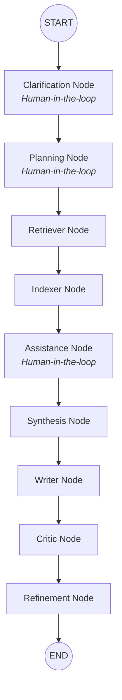

# Research Agent v2.0 - Multi-Agent Discovery System

A professional-grade AI Research Production System built with **LangGraph**, **FastAPI**, and **Next.js**. Research Agent v2.0 is designed for high-fidelity academic synthesis, deep-source retrieval, and real-time "Live Lab" analysis.


##  Version 2.0 Highlights

- **Perplexity-Style "Live Lab"**: A real-time dynamic workspace that streams "thinking" tokens and drafted sections as they are generated.
- **Light vs. Deep Research**: 
    - **Light Mode**: Quick scans of 10-15 sources for rapid insight.
    - **Deep Research**: Exhaustive investigation across 50+ academic and web sources.
- **High-Velocity Parallel Retrieval**: Flattened search architecture that queries Tavily, OpenAlex, and arXiv simultaneously.
- **Academic Precision (IEEE)**: Specialized agents for writing, critiquing, and refining manuscripts with strict adherence to academic standards and citation styles.
- **Persistent Knowledge Base**: Integrated **Qdrant Vector Store** for indexing retrieved literature, allowing for semantic cross-referencing during drafting.
- **ArXiv & OpenAlex Native**: Robust handling of academic APIs with rate-limit resilience, retry logic, and API key support.

## 🛠️ Performance Tech Stack

### Intelligence & Orchestration
- **Framework**: LangGraph (Async Node Execution)
- **API Engine**: FastAPI + Server-Sent Events (SSE) for per-token streaming
- **Vector Intelligence**: Qdrant (Local or Cloud)
- **Primary LLM**: OpenRouter (Gemini 2.0 Pro / Llama-3-70B)
- **Fallback LLM**: Groq (High-speed Llama-3 nodes)

### Frontend "Live Lab"
- **Framework**: Next.js 14+ (App Router, TypeScript)
- **Motion**: Framer Motion (Agent status animations)
- **Aesthetics**: Premium Glassmorphism & Parchment Theme
- **PDF Export**: html2pdf.js for automated IEEE manuscript generation

## 📂 Architecture

### Directory Structure
```text
├── backend/
│   ├── agents/          # Async Agent Nodes (Planner, Retriever, Indexer, Synthesis, Writer, Critic, Refinement)
│   ├── api/             # SSE Event Generators and FastAPI Endpoints
│   ├── graph/           # Persistent LangGraph State Workflow
│   ├── utils/           # LLM Providers & Custom Embeddings (Mistral/OpenRouter)
│   └── requirements.txt
├── frontend/
│   ├── src/components/  # Dashboard, Live Workspace, and Report Viewer
│   ├── src/lib/         # SSE Event Callbacks and API Client
│   └── tailwind.config.ts
└── README.md
```

### Agent Workflow Diagram


## ⚙️ Setup & Deployment

### 1. Prerequisites
- Python 3.10+
- Node.js 18+
- [Tavily API Key](https://tavily.com/)
- [OpenAlex API Key](https://openalex.org/) (Recommended for higher rate limits)
- [OpenRouter API Key](https://openrouter.ai/) (Primary provider)

### 2. Backend Initialization
```bash
cd backend
python -m venv venv
source venv/bin/activate
pip install -r requirements.txt
```

Create a `.env` in `backend/`:
```env
# API Keys
OPENROUTER_API_KEY=your_key
TAVILY_API_KEY=your_key
OPENALEX_API_KEY=your_key

# Vector Database
QDRANT_URL=http://localhost:6333
# QDRANT_API_KEY=if_using_cloud

# Model Config
EMBEDDING_MODEL=mistralai/mistral-embed-2312
WRITING_MODEL=google/gemini-2.0-pro-exp-02-05:free
```

### 3. Frontend Initialization
```bash
cd frontend
npm install
npm run dev
```

## 🤖 Research Workflow (v2)

1. **Clarification**: Agent aligns with your intent through 2-3 scoping questions.
2. **Strategy**: A detailed research brief and 5-7 section blueprint are generated.
3. **Retrieval**: Parallel extraction from Web, ArXiv, and OpenAlex.
4. **Indexing**: Semantic chunks are stored in Qdrant.
5. **Synthesis**: The "Live Lab" begins streaming the core findings.
6. **Drafting**: The Writer streams a full IEEE manuscript section-by-section.
7. **Critique & Polish**: A specialized agent reviews and refines for academic perfection.

## 📝 License

Developed for high-impact research automation. Distributed under the MIT License.
